# Automatic Number Plate Recognition (ANPR) System

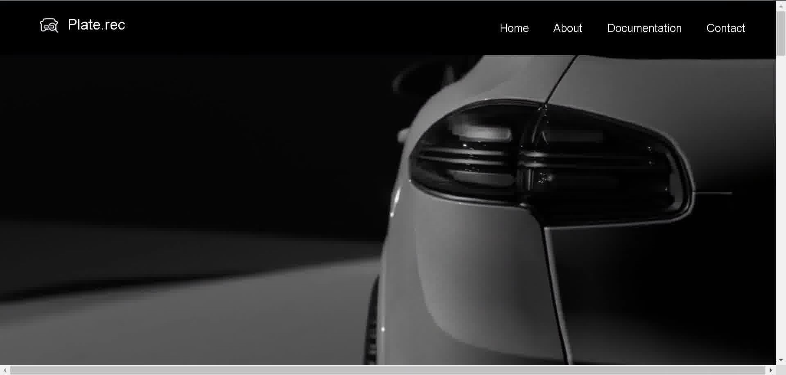  
*Screenshot of the ANPR system in action.*

## Table of Contents
- [Introduction](#introduction)
- [Features](#features)
- [Technologies Used](#technologies-used)
- [Project Structure](#project-structure)
- [Setup and Installation](#setup-and-installation)
- [How to Use](#how-to-use)
- [Screenshots](#screenshots)
- [Future Enhancements](#future-enhancements)
- [Contributing](#contributing)
- [License](#license)
- [Acknowledgements](#acknowledgements)

---

## Introduction
The Automatic Number Plate Recognition (ANPR) System is a computer vision-based project designed to detect and recognize vehicle license plates from images using YOLO (You Only Look Once) for object detection and Tesseract OCR for text extraction. This application is ideal for traffic management, parking systems, and security applications.

## Features
- License plate detection using YOLO deep learning model.
- Character segmentation and recognition with Tesseract OCR.
- User-friendly web interface built using Flask.
- Handles various license plate styles and environmental conditions.
- Simple and intuitive setup.

## Technologies Used
- **Programming Language**: Python
- **Libraries**: OpenCV, NumPy, TensorFlow, Keras, Tesseract OCR, Flask
- **Framework**: Flask for the web interface
- **Model Format**: ONNX for YOLO model

## Project Structure


## Description of Files

- **app.py**: The main application file that initializes and runs the Flask server.
- **deeplearning.py**: Contains the logic for automatic number plate recognition (ANPR) using deep learning techniques.
- **static/**: Directory containing all static files such as images and models.
  - **upload/**: Folder for storing uploaded images.
  - **predict/**: Folder for storing output images with detection results.
  - **models/**: Folder containing the YOLO model files used for object detection.
- **templates/**: Contains HTML template files for rendering views.
  - **index.html**: The main HTML page served to users.
- **requirements.txt**: A text file listing all the required Python packages for the project.
- **README.md**: Documentation file providing an overview of the project, installation instructions, and usage guidelines.


 # Project documentation
 
## Setup and Installation
Follow these steps to set up the project on your local machine:

1. **Clone the Repository**
   ```bash
   git clone https://github.com/yourusername/ANPR-System.git
   cd ANPR-System
2. **Create a Virtual Environment**
    ```bash
    python -m venv venv
    source venv/bin/activate   # On Linux or macOS
    venv\Scripts\activate      # On Windows
3. **Install Dependencies**
    ```bash
    pip install -r requirements.txt
4. **Download the YOLO Model**

- Place the YOLO model file (best.onnx) in the static/models/ directory. Make sure it is the correct model trained for license plate detection.
5. **Set Up Tesseract OCR**

-   Install Tesseract OCR from this link.
    Make sure to add Tesseract to your system's PATH.
6. **Run the Flask Application**
    ```bash
    python app.py
- The app will run on http://127.0.0.1:5000/. You can open this URL in your browser.
# How to Use
1. Open the web app in your browser.
2. Upload an image containing a vehicle's license plate.
3. The system will detect the license plate, recognize the 
4. characters, and display the result on the page.
# Future Enhancements
-   Support for real-time video input and processing.
-   Multi-language character recognition.
-   Integration with cloud services for scalability.
-   Mobile application development for on-the-go ANPR.
# Contributing
- Contributions are welcome! If you have any ideas or improvements, feel free to open an issue or submit a pull request.

### Overview of website
<table>
  <tr>
    <td>Screenshot 1</td>
    <td>Screenshot 2</td>
    <td>Screenshot 3</td>
    <td>Screenshot 4</td>
  </tr>
  <tr>
    <td>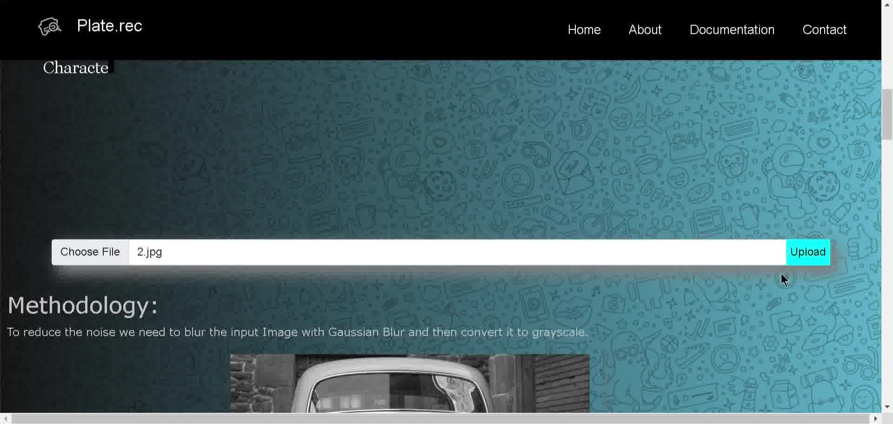</td>
    <td>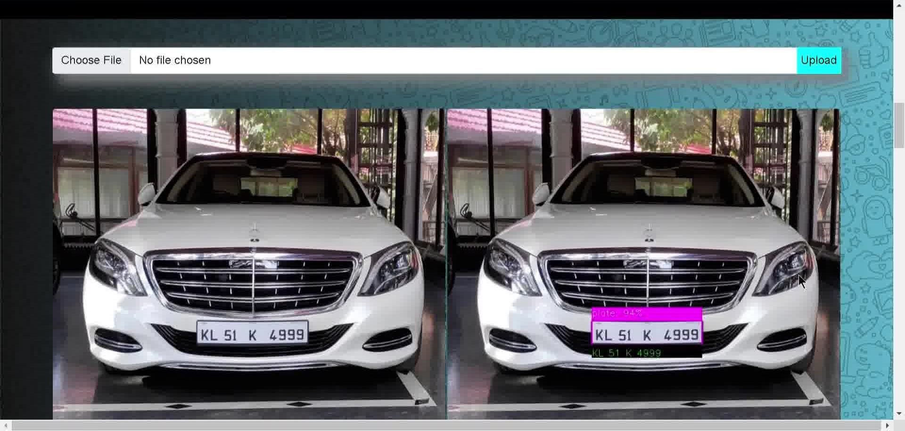</td>
     <td>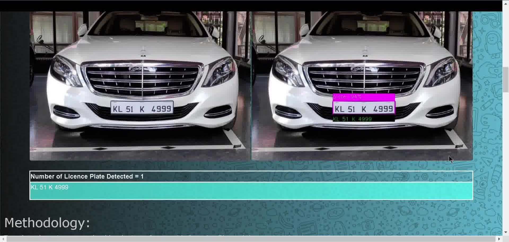</td>
    <td>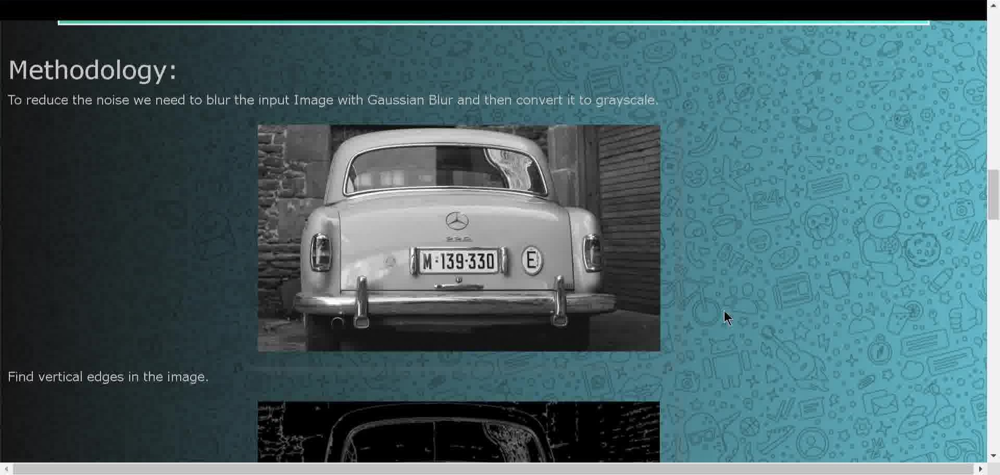</td>
  </tr>
    <td>Screenshot 5</td>
    <td>Screenshot 6</td>
    <td>Screenshot 7</td>
    <td>Screenshot 8</td>
  </tr>
  <tr>
    <td>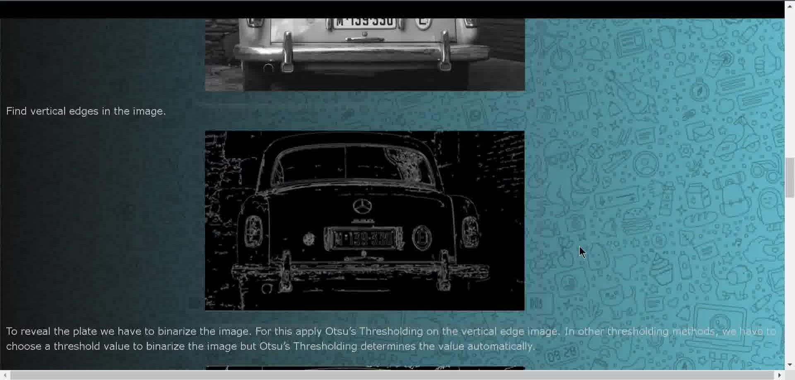</td>
    <td>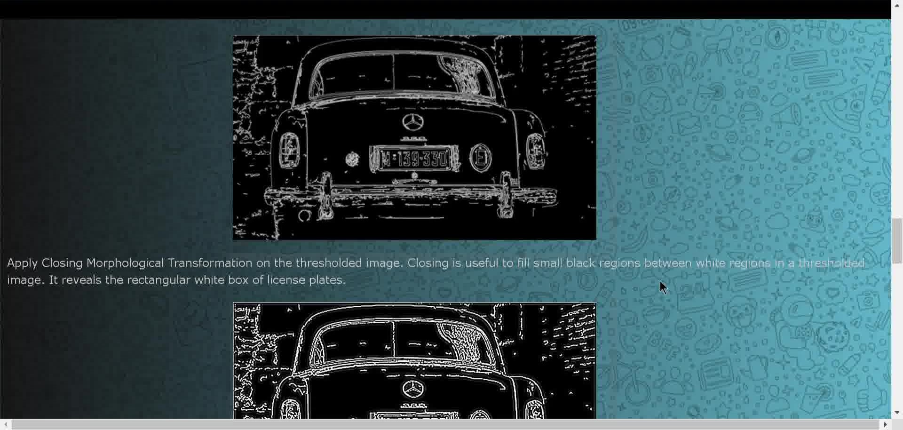</td>
     <td>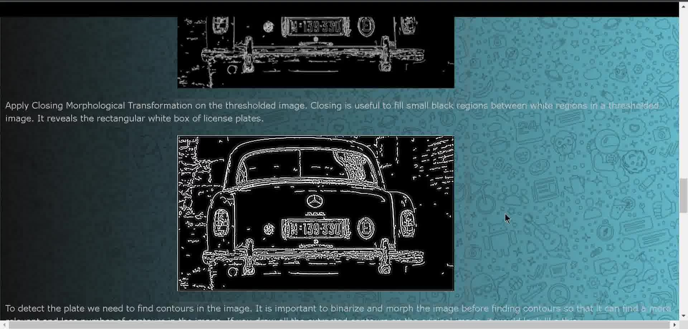</td>
    <td>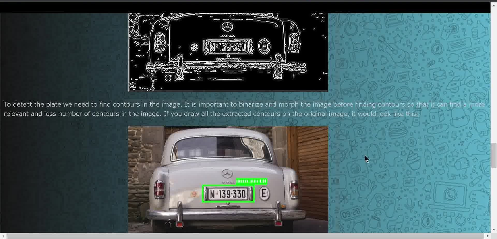</td>
  </tr>
  <td>Screenshot 9</td>
    <td>Screenshot 10</td>
    <td>Screenshot 11</td>
  <td>Screenshot 12</td>
  </tr>
  <tr>
    <td>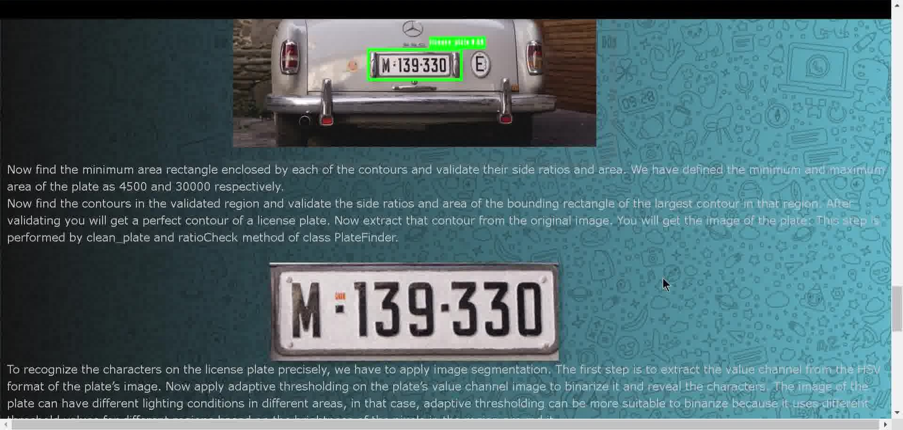</td>
    <td>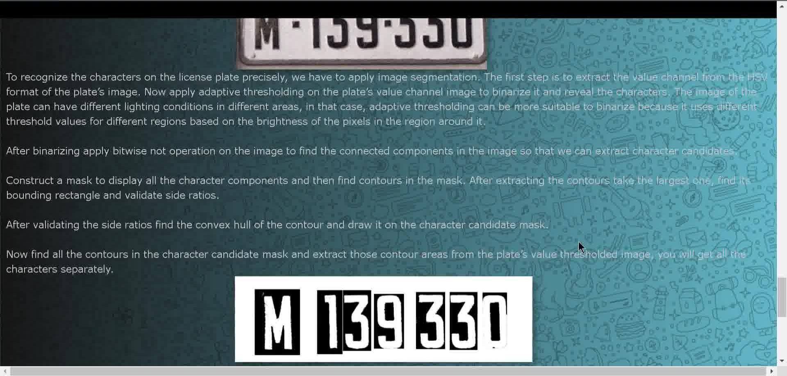</td>
     <td>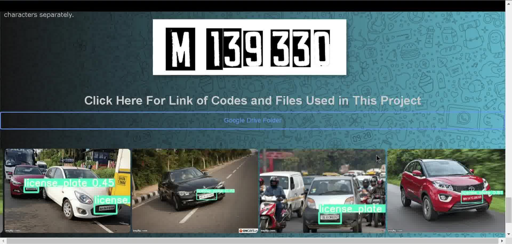</td>
    <td>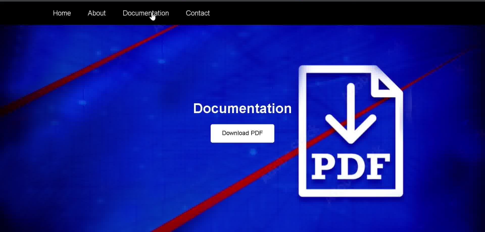</td>
  </tr>
  <td>Screenshot 13</td>
  </tr>
  <tr>
    <td>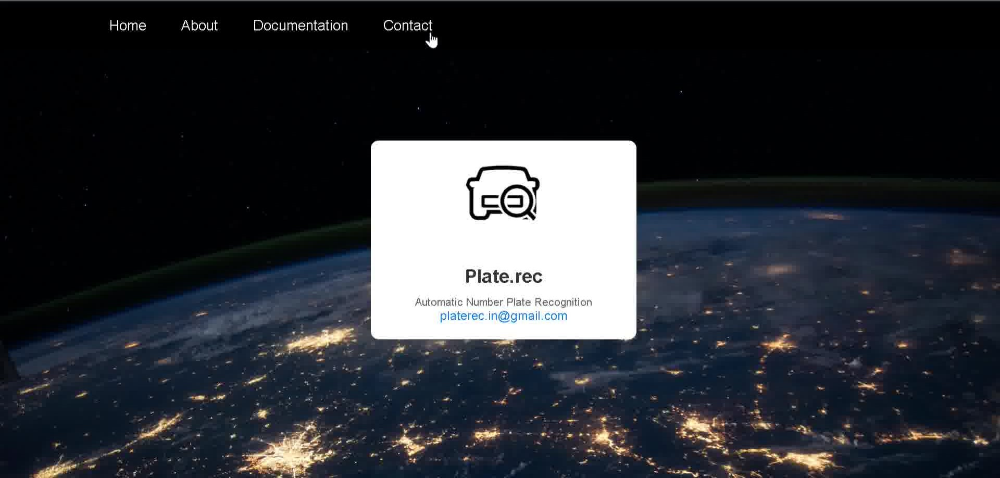</td>
  </tr>
 </table>
## Acknowledgements

 - [OpenCV](https://opencv.org/)
 - [Tesseract OCR](https://github.com/tesseract-ocr/tesseract)
 - [YOLO](https://github.com/ultralytics/yolov5)
 - [Flask](https://flask.palletsprojects.com/en/stable/)
